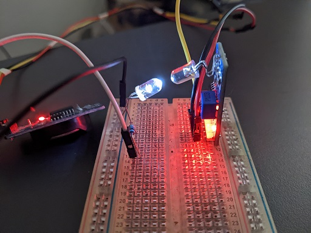

Power Meter Pulse LED
=====================

A simple Sketch that attempts to simulate the pulsing LED on a Power Meter.

Some Meters have a LED that blinks (pulses) in relation to your power consumption.
These LEDs usually have a pulse rate of a 1.000 blinks (pulses) for every kWh consumed.
Some Power Meters really like to 'have the LED blinking' though, and use a pulse rate set to 10.000!

Note: It's a bit inaccurate at certain simulated power consumption levels. It'll keep the intervals steady 
but the LED will pulse slightly too fast or slow, and thus not reflect the set level exactly - it'll be a few Watts off. 
It's simply not fast enough to manage the required time resolution.  

I have tested it, with a pulse rate set to 1.000. Here's the results:

| Attempt |  Result | 
|--------:|---------|
|   100 W |   100 W |
|   512 W |   512 W |
|  1000 W |  1000 W |
|  2771 W |  2771 W |
|  2847 W |  2848 W | 
|  2963 W |  2965 W | 
|  3020 W |  3020 W |
|  3027 W |  3028 W |
|  5000 W |  5000 W |
|  5850 W |  5854 W |
|  7500 W |  7500 W |
| 10000 W | 10000 W |

Components
----------

* A White LED (other colours might work).
* A 330Ω resistor (or anything from 220 to 1k).
* An ESP board (I recommend an ESP32, but an ESP8266 might work for you)

Assets
------
Here's a picture of the test-bed I used to test the accuracy of my [ESPHome Power Meter](https://github.com/zenzay/esphome-projects/tree/main/power-meter).

