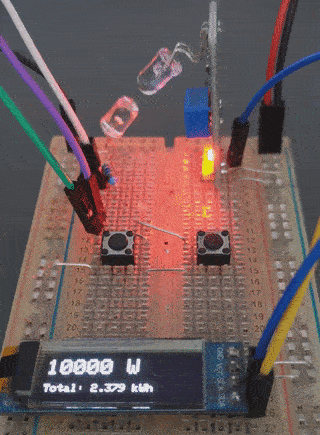

Power Meter Pulse LED
=====================

A simple Sketch that attempts to simulate the pulsing LED on a Power Meter.

Some Electricity Meters have a LED that pulses in relation to your power consumption.
These LEDs usually have a pulse rate of a 1.000 pulses for every kWh consumed.
Some Power Meters really like to 'have the LED blinking' though, and use a pulse rate set to 10.000!

Components
----------

* A White LED (other colours might work).
* A 330Ω resistor (or anything from 220 to 1k).
* An ESP board (I recommend an ESP32, but an ESP8266 might work for you)

Assets
------
Here's a gif of the test-bed I used to test the accuracy of my [ESPHome Power Meter](https://github.com/zenzay/esphome-projects/tree/main/power-meter).

